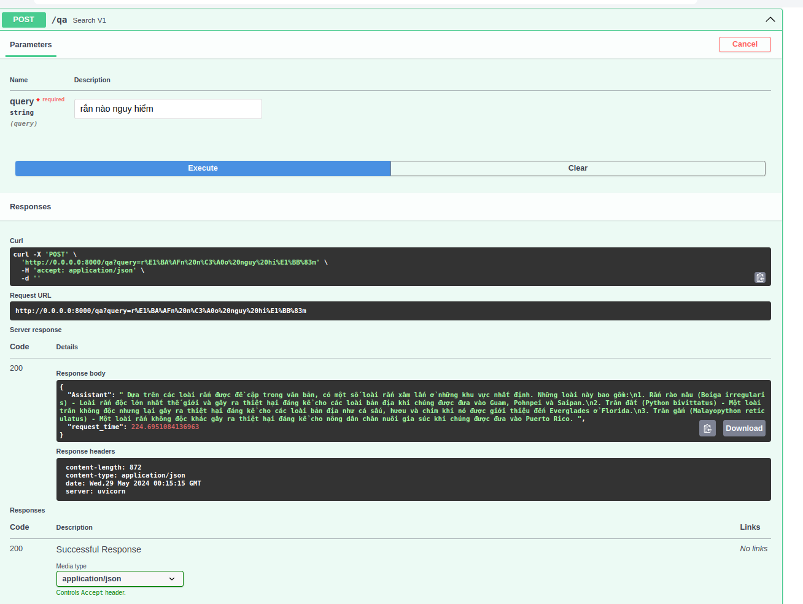

# rangpt
**in progress**

## how to use
- add qdrant api key in `.env`
- then download the model and run `main.py`
```
!wget https://huggingface.co/uonlp/Vistral-7B-Chat-gguf/resolve/main/ggml-vistral-7B-
chat-q8.gguf

!python main.py
```
## demo

