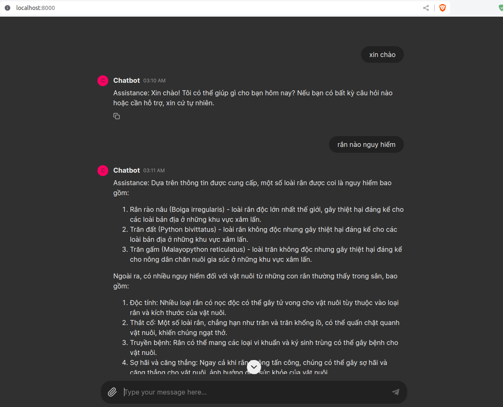
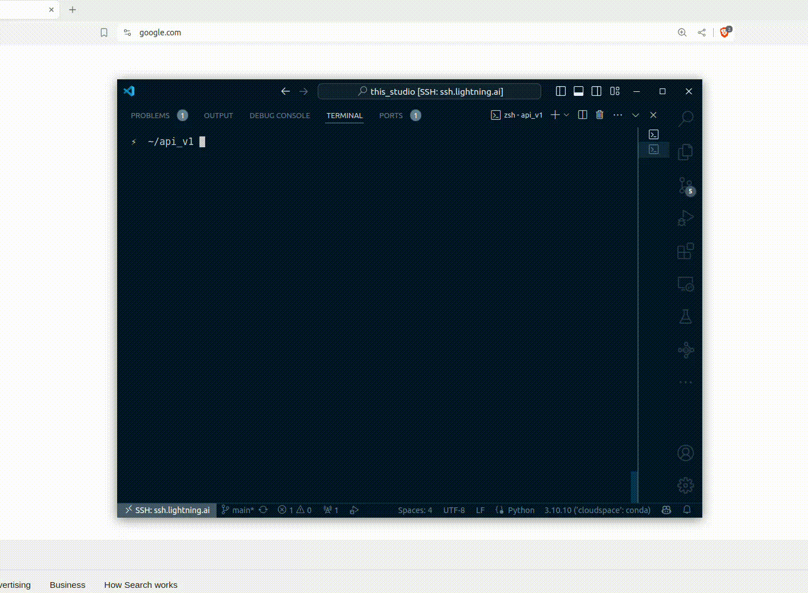

# RANGPT
**in progress**
## I. Demo

|Chatbot with Chainlit       | QA with FastAPI                         |
|----------------------------|----------------------------|
| [](image.png) | [](image.png) |

## II. How to use 
- First, go to the src folder, create a .env file, and then add the Qdrant API key and HuggingFace token (make sure you have access to Viet-Mistral/Vistral-7B-Chat) with the following format:
```
hf_token = "YOUR_HF_TOKEN"
qdrant_api_key = "YOUR_QDRANT_API_KEY"
```
- You can run my code with Docker or Conda

### With Docker
```
docker compose -f docker-compose.yaml up -d

```
- **Note:** GPU is required to run the chatbot with this version.

### With Conda

- Create a virtual environment and install the required packages
```
conda create -n rangpt python=3.10
conda activate rangpt
pip install -r requirements.txt
```

- if you want to use the chatbot with Chainlit, run
```
chainlit run cl.py
```
or 
```
python cl.py
```

- if you want to use the chatbot with FastAPI, run
```
python app.py
```
then go to `localhost:8000/docs` to test the API


## llama.cpp (in progress)
- download the model from [here](https://huggingface.co/uonlp/Vistral-7B-Chat-gguf/tree/main) and run `main.py`
```
!wget https://huggingface.co/uonlp/Vistral-7B-Chat-gguf/resolve/main/ggml-vistral-7B-chat-q4_0.gguf
!mv ggml-vistral-7B-chat-q4_0.gguf model/
!python main.py
```

